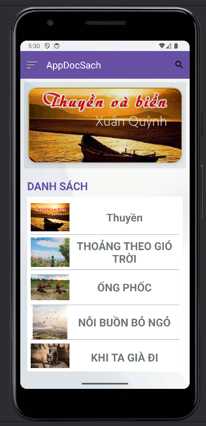
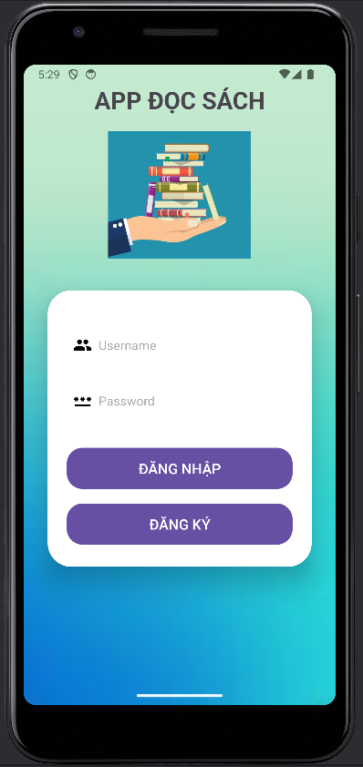
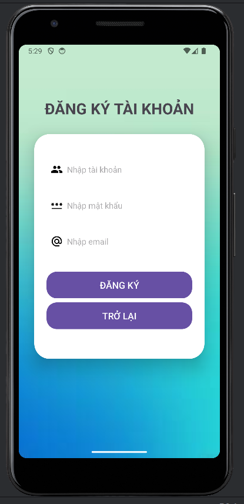
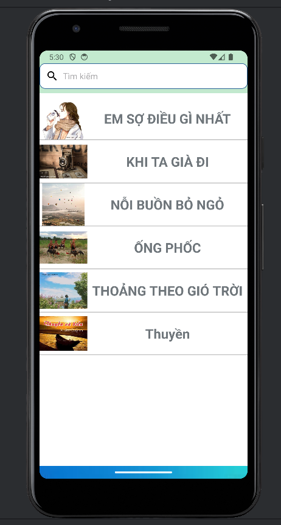
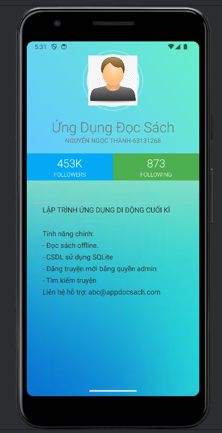
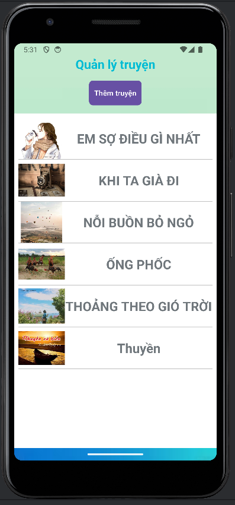

# Tên Ứng Dụng: App đọc sách

## Công Nghệ Sử Dụng
- **Ngôn ngữ lập trình:** Java
- **Cơ sở dữ liệu:** SQLite
- **Môi trường phát triển:** Android Studio
  
## Tính Năng

- Đăng nhập, đăng ký tài khoản 
- Màn hình chính để hiển thị danh sách truyện
- Màn hình để hiển thị thông tin app
- Phân quyền admin, admin có thể thực hiện thêm xóa,sửa các sách có trong app

## Hình Ảnh Giao Diện

Một số hình ảnh minh họa giao diện ứng dụng:

| Màn Hình | Hình Ảnh | Mô Tả |
|----------|----------|-------|
| **Màn Hình Chính** |  | *Hiển thị danh sách các sách và tùy chọn cho người dùng lựa chọn.* |
| **Màn Hình Đăng Nhập** |  | *Cho phép người dùng nhập thông tin để đăng nhập vào hệ thống.* |
| **Màn Hình Đăng Ký** |  | *Người dùng có thể tạo tài khoản mới.* |
| **Màn Hình Tìm Kiếm** |  | *Cho phép tìm kiếm sách theo tiêu đề.* |
| **Màn Hình Thông Tin** |  | *Cung cấp thông tin về ứng dụng và nhà phát triển.* |
| **Màn Hình Quản Lý Truyện của Admin** |  | *Cho phép admin quản lý các sách trong ứng dụng (thêm, xóa, sửa).* |

